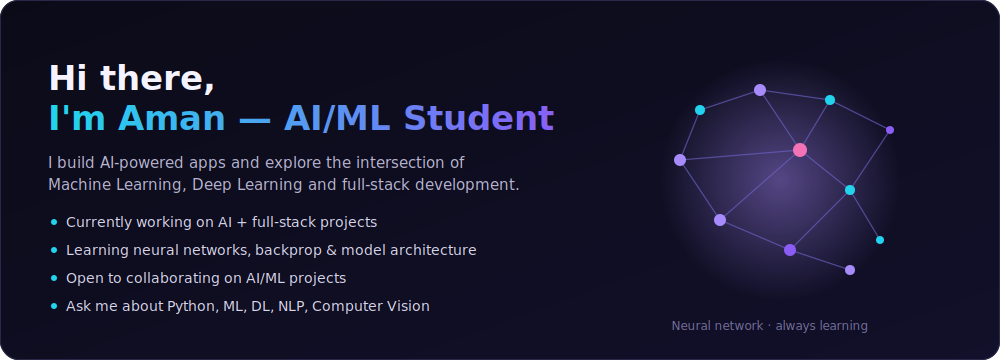

 

 

## 🧠 Tech stack

<table width="100%">
<tr>
<td align="center" width="20%"><b>Languages</b>  

</td>
<td align="center" width="20%"><b>AI / ML</b>  
 
NumPy · Pandas · Scikit-learn
</td>
<td align="center" width="20%"><b>Frontend</b>  

</td>
<td align="center" width="20%"><b>Backend / DB</b>  

</td>
<td align="center" width="20%"><b>Tools</b>  

</td>
</tr>
</table>

 

## 🚀 Featured projects

<table width="100%">
<tr>
<td width="33%">

</td>
<td width="33%">

</td>
<td width="33%">

</td>
</tr>
</table>

 

## 📊 GitHub stats

<table width="100%">
<tr>
<td width="34%">

</td>
<td width="33%">

</td>
<td width="33%">

</td>
</tr>
</table>

 

## 📈 Contribution activity

  

## 🌐 Let's connect

  

Code. Train. Innovate. Repeat.

